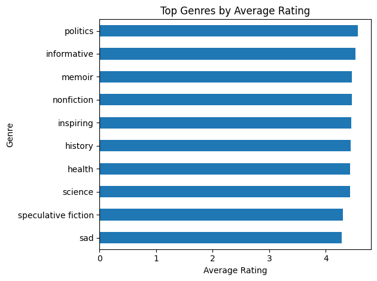
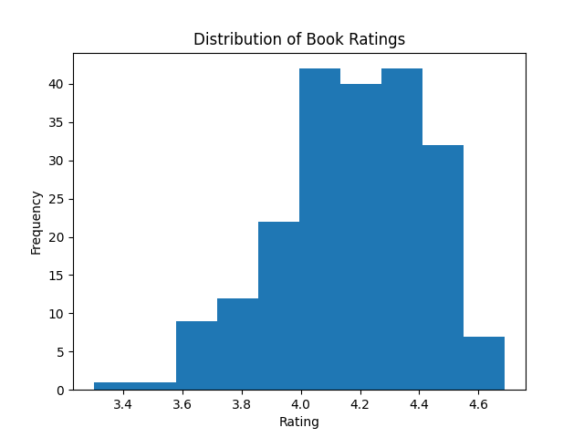
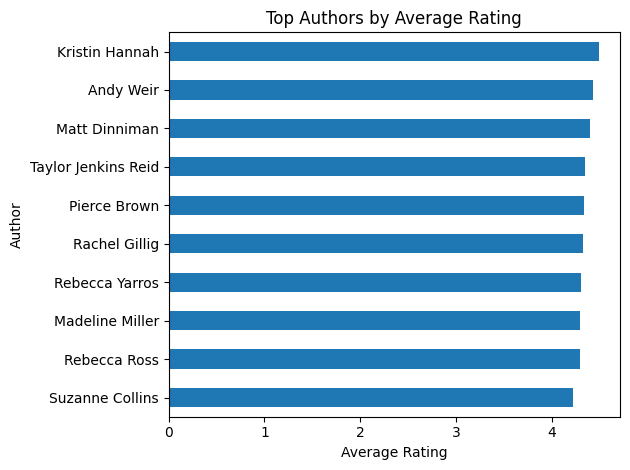

## Introduction
While I've been a student I am sad to say I have somewhat fallen out of my habbit of reading for fun. I love reading, but seem to lack the time to do it, and commintting to a book that I know little about is risking wasting the little time I do have to read. Thus when prompedted for this school project of compling a new data set books and book reviews came to mind. I enjoy reading full series that I can really get into, but sometimes series have a slow start or drop off later. I complied this list to markl which books are in series, which stand alone, and other useful information that can be broken down.

I also think this data set could have some use to writters. The website it's based from not only marks genre but style tags for books. Meaning a asspiring writedr could use this set to see what types of books are being well recieved and trending as time goes on. My wife is a writer and incurabed me to include that feature. 

## Data Collection

The data for this project was collected by building a custom web scraping pipeline targeting the browse functionality of the StoryGraph platform. The goal was to extract a structured dataset of books including metadata such as title, author, series membership, page count, publication year, genre tags, and links to individual book pages.

### Scraping Strategy

The StoryGraph browse page uses dynamic loading (infinite scroll) to display books. This means that only a subset of results is available in the initial HTML, with additional books loaded as the user scrolls. To handle this, I used Selenium to automate a browser session and simulate user scrolling behavior.

The scraper initializes a Chrome WebDriver and navigates to the browse page. A loop then executes JavaScript to scroll to the bottom of the page multiple times, with short delays between scrolls to allow new content to load. After sufficient scrolling, the full page source is captured and passed to BeautifulSoup for parsing.

```python
for i in range(10):
    driver.execute_script("window.scrollTo(0, document.body.scrollHeight);")
    time.sleep(2)
```    

This approach ensures that a larger pool of books (roughly 200 entries) is loaded into the DOM before extraction begins.

### HTML Paring and Feature Extraction
Once the page content is loaded, BeautifulSoup is used to locate each book container. Each book is represented by a <div> element with the class book-pane-content, which serves as the primary unit of observation.

```python
books = soup.find_all("div", class_="book-pane-content")
```   
For each book container, the scraper extracts the following features: Title, Author, Series Indicator, Link to the book page, Page Count, Publication Year, and Genres/Tags.

I ran into another hippcup with the auto scrolliong feature being imperfect and double counting serveal books. I used the unique 'Links' as an idenitifer to remove any duplicate hits, and strucutred it in a data frame. That was the easy part.

### The Struggle of the Ratings
A major obsticle I had to overcome was that the book ratings (The feature I cared most about) isn't on the main browse page I was scraping. The ratings and reviews were hidden on each books unique page. I had to learn and use a different method.
Because the rating is rendered dynamically, the scraper uses Selenium’s explicit wait functionality to ensure the relevant element is fully loaded before attempting extraction. Specifically, the scraper targets the HTML element containing the rating using a CSS selector tied to the page’s accessibility label (`aria-label`), which reliably contains the rating information.

```python
rating_element = WebDriverWait(driver, 10).until(
    EC.presence_of_element_located(
        (By.CSS_SELECTOR, "div[aria-label*='Book rating'] span.average-star-rating")
    )
)
rating = rating_element.text.strip()
```
This process is repeated for each book in the dataset, and the extracted ratings are stored in a list and appended to the main DataFrame as a new column. To improve usability and monitor progress during this relatively time-intensive step, a progress bar was implemented using the tqdm library. This provides real-time feedback on scraping progress across all entries. Although this approach is slower than scraping static content, it ensures accurate retrieval of dynamically loaded data and significantly enhances the analytical value of the final dataset. I also chose to remove the "link" subsection from the final databank as it's not useful for anaylsis.


## First 10 Rows
| Title                                        | Author              | In A Series   |   Pages |   Year | Genres/Tags                                                                                            |   Rating |
|:---------------------------------------------|:--------------------|:--------------|--------:|-------:|:-------------------------------------------------------------------------------------------------------|---------:|
| Project Hail MaryAndy Weir                   | Andy Weir           | False         |     476 |   2021 | ['funny', 'adventurous', 'hopeful', 'science fiction', 'fiction', 'medium-paced']                      |     4.5  |
| In Her Own LeagueLiz Tomforde                | Liz Tomforde        | True          |     440 |   2026 | ['sports', 'emotional', 'romance', 'lighthearted', 'funny', 'fiction', 'medium-paced', 'contemporary'] |     4.47 |
| This Story Might Save Your LifeTiffany Crum  | Tiffany Crum        | False         |     368 |   2026 | ['emotional', 'thriller', 'crime', 'tense', 'fiction', 'fast-paced', 'mysterious']                     |     4.22 |
| The CorrespondentVirginia Evans              | Virginia Evans      | False         |     304 |   2025 | ['reflective', 'emotional', 'literary', 'hopeful', 'fiction', 'medium-paced', 'contemporary']          |     4.54 |
| Dungeon Crawler CarlMatt Dinniman            | Matt Dinniman       | True          |     446 |   2020 | ['fantasy', 'funny', 'adventurous', 'science fiction', 'fiction', 'fast-paced']                        |     4.4  |
| And Now, Back To YouB.K. Borison             | B.K. Borison        | True          |     448 |   2026 | ['emotional', 'romance', 'lighthearted', 'funny', 'fiction', 'medium-paced', 'contemporary']           |     4.3  |
| I Who Have Never Known MenJacqueline Harpman | Jacqueline Harpman  | False         |     201 |   1995 | ['reflective', 'dark', 'literary', 'fiction', 'dystopian', 'medium-paced', 'mysterious']               |     4.21 |
| Heart the LoverLily King                     | Lily King           | False         |     249 |   2025 | ['reflective', 'sad', 'emotional', 'literary', 'fiction', 'fast-paced']                                |     4.39 |
| Wild Dark ShoreCharlotte McConaghy           | Charlotte McConaghy | False         |     302 |   2025 | ['dark', 'emotional', 'thriller', 'literary', 'fiction', 'medium-paced', 'mysterious']                 |     4.2  |
| Half His AgeJennette McCurdy                 | Jennette McCurdy    | False         |     276 |   2026 | ['dark', 'emotional', 'literary', 'fiction', 'fast-paced', 'contemporary']                             |     3.51 |

## Data Analysis
First simple chack I ran with this is highest rated stand alone book and the highest rated series book. The winners are~
Best Standalone Book:
Title     One Day, Everyone Will Have Always Been Agains...
Rating                                                 4.69

Best Series Book:
Title     The Way of KingsBrandon Sanderson
Rating                                 4.63

## Top Performing Genres
Next I wanted to check what tags where performing the best:


Kind of a let down there with politics and informitive doing the best, but one could always filter for the geners they want or search within a specific genere. 

## Average Ratings of Top 200 Books


## Top Authors
Only those with multiple enteries were counted


## My Take Away
For the sake of my own limited computing capasity I only took about the top 200 entries of the trending tab. My repo could easliy be tweeked to gather the booklists from a bigger selection or different area of the page if more varied info is wanted. If nothing else this was a great learning experiance for me on how to be smarter with scraping and were you get your data from.

**Full Code Repository: **[GitHub - Data Acquisition](https://github.com/gunnargriffith/Data-Acquisition/tree/main)

**Book Review Site: **[The Story Graph](https://app.thestorygraph.com/browse)