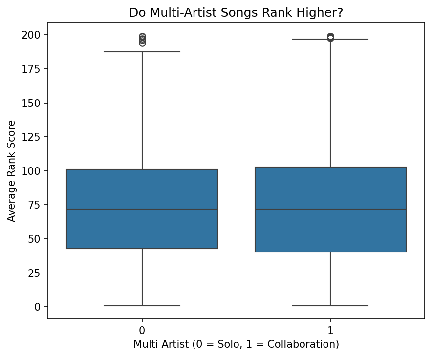

## Data Analysis Tutorial - Spotify Top 200

    

Spotify provides a public API that includes playlist data and detailed audio features
for individual tracks, such as Danceability, Energy, Speechiness, and Valence.

For this project, I analyze a dataset containing Spotify’s official Top 200 songs
from 2016 to 2023. The goal is to explore which musical characteristics are most
associated with higher-ranking songs and whether collaborations outperform solo artists.

### Research Questions

1. Which audio features significantly predict higher chart ranking?
2. Do songs performed by multiple artists achieve higher rankings than solo-artist songs?

### Dataset Overview

The dataset includes the following variables:

- Rank
- Title
- Artists
- Danceability
- Energy
- Speechiness
- Acousticness
- Instrumentalness
- Valence
- Points (Total)

Each row represents a song’s daily appearance in the Spotify Top 200.

### Data Cleaning and Feature Engineering

To prepare the dataset for analysis, I:

- Created a `multi_artist` variable indicating whether a song has multiple performers.
- Converted ranking into a `rank_score` where higher values indicate better performance.
- Collapsed the dataset so each song appears only once.
- Computed average rank and total days in the Top 200 for each song.

#### Correlation Between Audio Features and Rank

The heatmap above shows how each audio feature correlates with average rank score. 
We can see which characteristics are most strongly associated with higher-ranking songs. 
Positive correlations indicate that higher values of a feature are linked to better rankings.

#### Multi-Artist Songs vs Solo Songs

This boxplot compares average rank scores for solo and multi-artist songs. 
It helps answer whether collaborations tend to perform better after controlling 
for audio features. We can see differences in the distribution of rank scores between the two groups.

#### Regression Coefficients of Audio Features and Collaboration Status

This plot shows the effect size of each feature on average rank score according to a 
linear regression model. Features with larger positive values are associated with higher ranks, 
while negative values indicate that increasing that feature tends to lower the ranking. 
The `multi_artist` coefficient shows the adjusted effect of collaborations on song ranking.

### Key Insights

- Danceability and Energy tend to be positively associated with higher rankings.
- Acousticness and Instrumentalness are negatively associated with rank.
- Multi-artist collaborations show a small positive effect on ranking.
- Songs that appear frequently in the Top 200 often exhibit these high-ranking audio features.

As a bonus fun fact that I enjoyed: The song featured the most days of any during this time period was
Sunflower by Post Malone with a incredible 3262 days included in the Top 200 Playlist. 